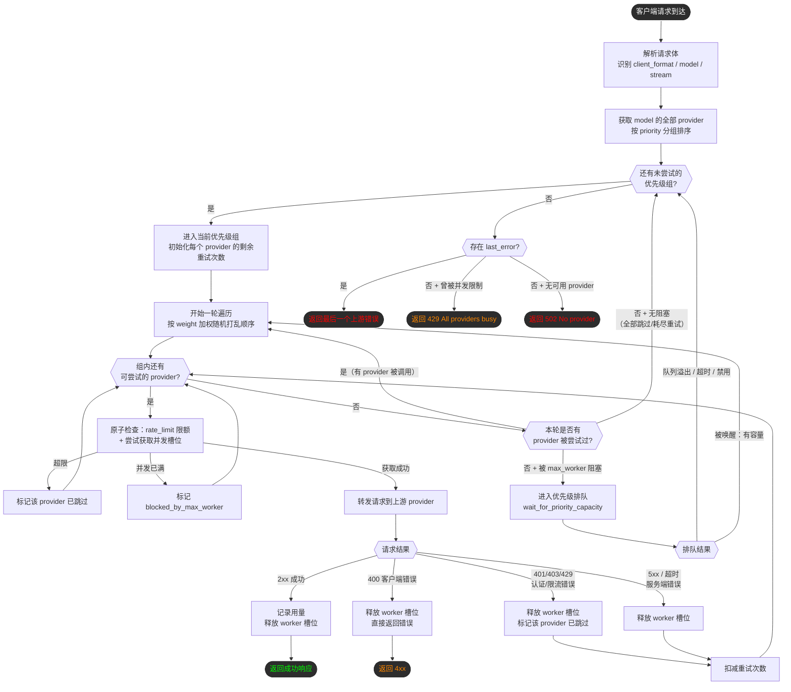

# AI API Gateway

轻量级 AI 接口网关，支持：
- 多提供商调度（优先级 + 权重）
- 自动重试与故障切换
- OpenAI / Claude / Gemini 请求格式兼容
- 上游协议格式自动转换（`openai` / `openai-response` / `claude` / `gemini`）
- Provider 限额与周期重置
- Provider 级并发上限（`rate_limit.max_worker`）

## 快速开始

1. 配置 `config/provider.json`
2. 启动：

```bash
docker-compose up -d
```

3. 验证：

```bash
curl http://localhost:6010/health
curl http://localhost:6010/v1/models
```

## 配置示例

见：`config/provider.example.json`

## 调度流程



## 核心配置说明

### `_global`
- `default_timeout`: 默认超时秒数
- `default_retry`: 默认重试次数
- `queue_overflow_factor`: 优先级队列溢出倍率（默认 `2.0`）
- `log_requests`: 是否记录请求日志
- `api_key`: 网关鉴权密钥（为空则不启用）

`queue_overflow_factor` 规则：
- `null`：按默认值 `2.0`
- `< 1`：按 `1.0` 处理
- `= 1`：不排队，当前优先级满并发后直接尝试下一优先级
- `NaN/Infinity/非法值`：按默认值 `2.0`

鉴权支持：
- `Authorization: Bearer <gateway_api_key>`
- `x-api-key: <gateway_api_key>`
- `x-goog-api-key: <gateway_api_key>`
- 查询参数 `?key=<gateway_api_key>`

### 模型层
- `providers`: provider 列表
- `max_worker`: 已废弃（若配置会被忽略，请改为在每个 provider 的 `rate_limit.max_worker` 配置）

### Provider 层
- `name`: provider 标识
- `endpoint`: 上游地址
- `api_key`: 上游 key
- `model`: 上游模型名
- `format`: `openai` / `openai-response` / `claude` / `gemini`
- `priority`: 优先级（越小越优先）
- `weight`: 同优先级权重（加权随机：权重越高被优先尝试的概率越大）
- `rate_limit`: 限额和并发配置
- `retry`: provider 重试次数
- `timeout`: provider 超时秒数
- `stream_support`: 是否支持流式
- `non_stream_support`: 是否支持非流式
- `enabled`: 是否启用
- `custom_headers`: 自定义请求头
- `max_context_length`: 最大上下文长度（预留）

### `rate_limit`
- `requests_per_period`: 周期内请求上限
- `tokens_per_period`: 周期内 token 上限
- `max_worker`: provider 当前最大并发上限（关键）
- `period_cron`: 重置周期（5 位 Cron）

最小示例：
```json
"rate_limit": {
  "requests_per_period": null,
  "tokens_per_period": null,
  "max_worker": 1,
  "period_cron": "0 0 * * *"
}
```

并发行为：
- `max_worker` 达到上限时，该 provider 会被调度器自动跳过；
- 网关会尝试同模型下的其他 provider，避免该 key 触发上游 429。
- 当同一优先级的 provider 都因 `max_worker` 满并发而不可用时，网关会进入该优先级排队。
- 若排队请求数超过 `（该优先级所有 provider 的 max_worker 总和）* queue_overflow_factor`，后续请求会自动转移到下一优先级。
- 排队上限按 `floor(总max_worker * queue_overflow_factor)` 计算，确保语义是“超过阈值才转移”。

## API 路由

### OpenAI 兼容
- `GET /v1/models`
- `POST /v1/chat/completions`
- `POST /v1/completions`
- `POST /v1/embeddings`

### Claude 兼容
- `POST /v1/messages`

### Gemini 兼容
- `POST /v1beta/models/<model>:generateContent`
- `POST /v1beta/models/<model>:streamGenerateContent`
- `POST /v1/models/<model>:generateContent`
- `POST /v1/models/<model>:streamGenerateContent`

### 管理接口
- `GET /health`
- `GET /admin/stats`
- `POST /admin/reload`
- `GET /admin/providers/<model_name>`

## 环境变量

- `CONFIG_PATH`（默认 `/app/config/provider.json`）
- `USAGE_DATA_DIR`（默认 `/app/data/usage`）
- `ENABLE_SCHEDULER`（默认 `true`）
- `LOG_LEVEL`（默认 `INFO`）
- `TZ`

## 说明

- 多实例部署时，`max_worker` 是进程内并发；若要全局并发，建议加外部协调（Redis/网关限流层）。
- 使用反向代理时，请关闭 SSE 缓冲。
